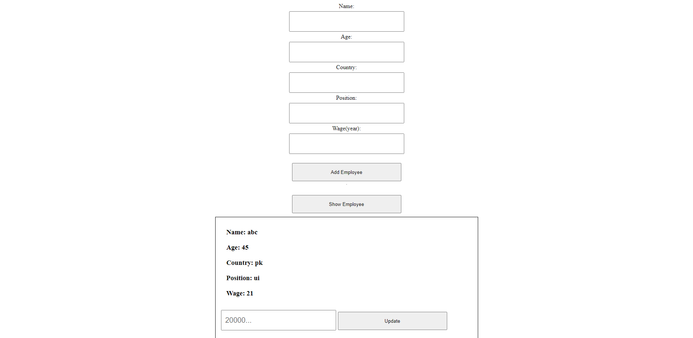

# React Node & Mysql CRUD App For Beginners

This project is to get every basic idea about the crud application using two different tech stacks.

**React**

**NodeJs**

**MySql**

There are two directories of this project you one for apis and second for the front end app.

## Available Scripts React (Client Dir)

In the project directory, you can run:

### `npm start`

Runs the app in the development mode.\
Open [http://localhost:3000](http://localhost:3000) to view it in your browser.

The page will reload when you make changes.\
You may also see any lint errors in the console.

### `npm run build`

## Available Scripts Node (Server Dir)

Runs apis in the development mode.
Open http://localhost:3001 to view it in your browser.

### `node index.js`

